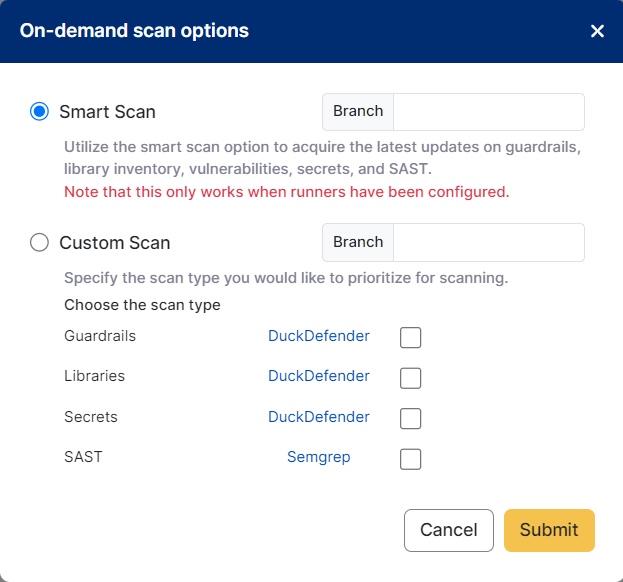

## How to use duckdefender in your VM
### Onprem runner configuration

Install docker on your VM. 
``` copy
sudo apt install -y docker.io (ubuntu) 
sudo yum install -y docker (Linux) 
```

Set the environment variable. (Copy the API_KEY value from user profile -> API 
Keys of FlyingDuck portal)  

-	Method1: export **FD_API_KEY=value** (variable holds until session is active)
- Method2: To ensure our setting remains after the session, we add the variable to **$HOME/.bashrc** for Bash.

nano ~/.bashrc -> add export FD_API_KEY=value at end of the file -> save the file -> source ~/.bashrc

Run the below docker command. 

```
docker run -d -e FD_API_KEY=${FD_API_KEY} --entrypoint /bin/sh flyingduckio/duckdefender:latest -c "duckdefender -d" 
```

Go to FlyingDuck portal select the repo to scan

**FlyingDuck (app.flyingduck.io) -> Dashboard -> code -> Repository -> search repo name -> select that repo -> click On-demand scan**
<br/>

<div style={{display:'flex', justifyContent:'center', alignItems:'center'}}>



</div>

Select your required scan, mention the **Branch** name and click on **submit**. 