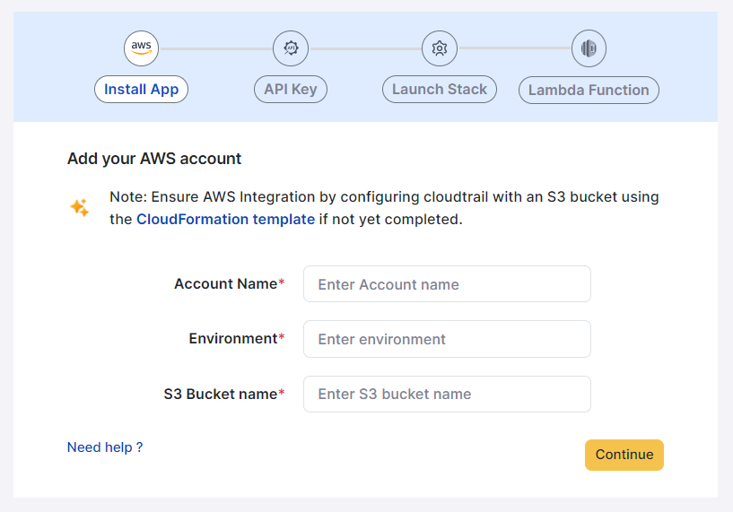
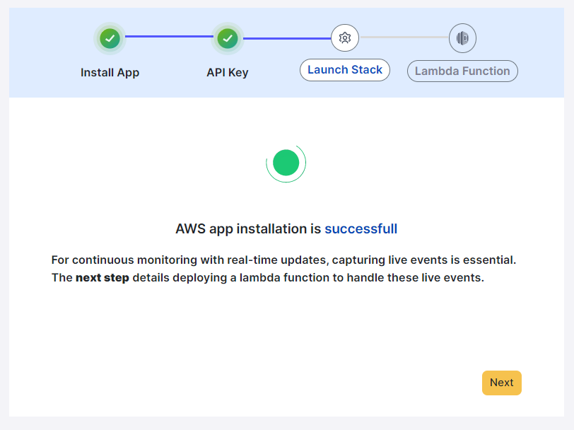
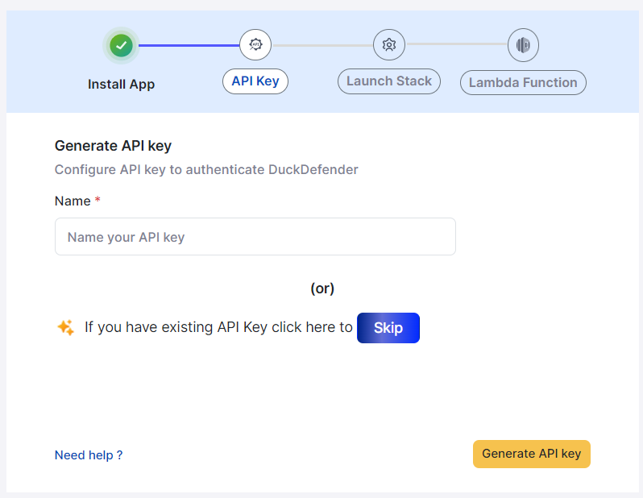
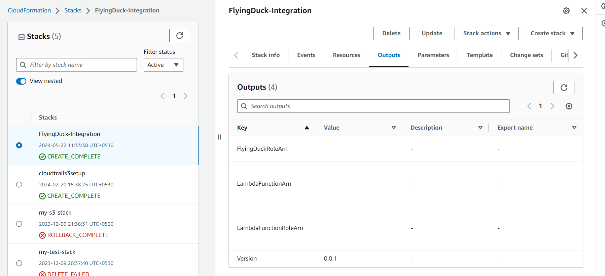
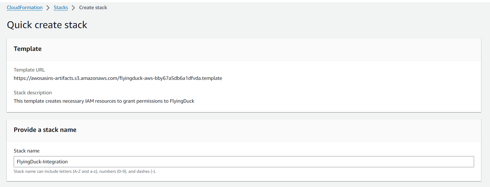
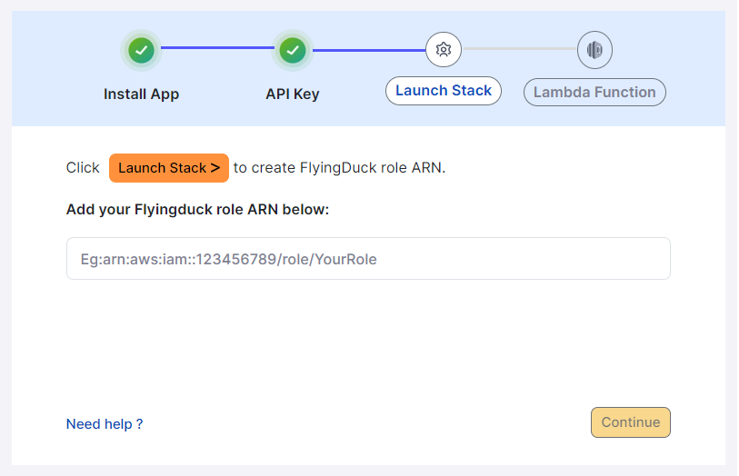
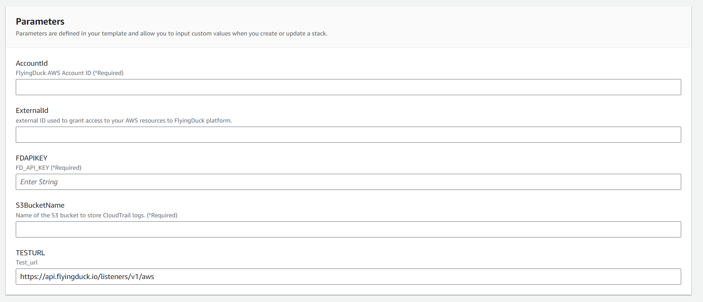
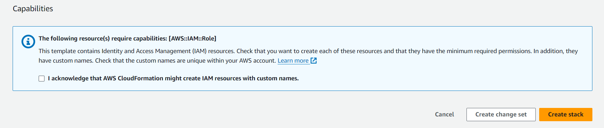
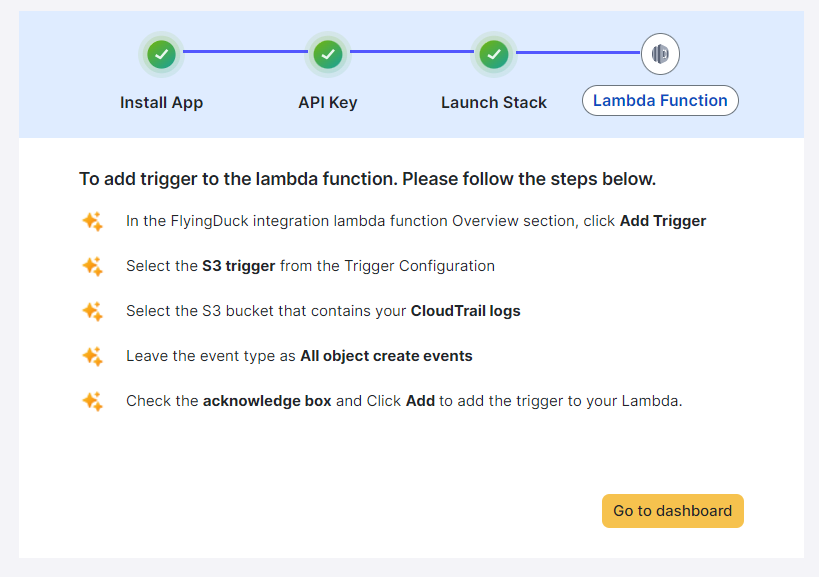

# AWS Integration

### Install App

For creating S3 bucket you need to go to aws and create a s3 bucket for that click on **cloudformation template** on flyingduck portal.

You will be asked to download a file.
go to cloud formation in aws, under stack click create stack, in the drop down select **with new resouses**

## Api key

If you've created API Key previously you can click on **Skip** or else you can create a new API Key.

Provide a name to your API Key that your about to create and click on **Generate API key**

A new API Key will be generated that will be shown once, so store it with you confidentially.

