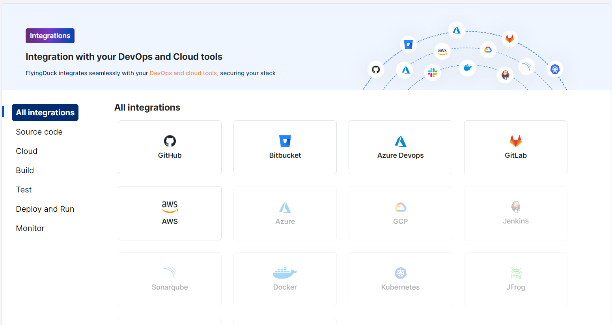
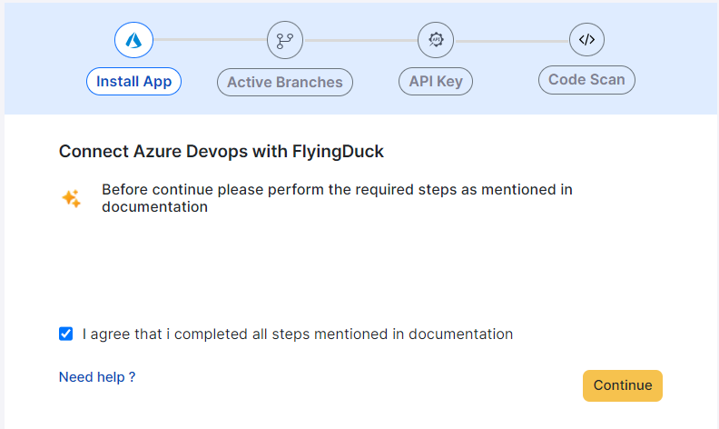
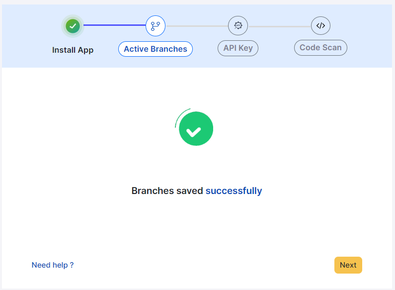
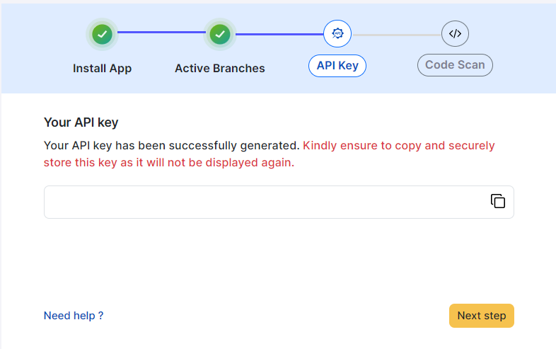
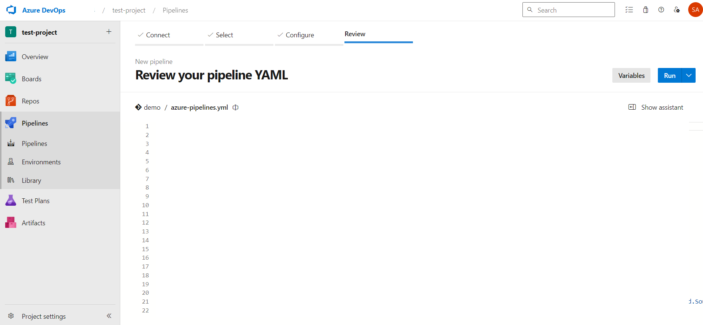

# Azure DevOps Integration


## App Registration
Before starting the integration, make sure u have logined to the azure website and open the terminal.

Click on "Cloud Shell" icon in navbar and type
```mdx copy
az login.
```
After entering the command, you will be able to see the below and follow the steps as shown.

``` mdx
Cloud Shell is automatically authenticated under the initial account signed-in with. Run 'az login' only if you need to use a different account
To sign in, use a web browser to open the page https://microsoft.com/devicelogin and enter the code E******S to authenticate.
```

After completing the validation , you will get the details that are specific to tenant.

Download flyingduck-azure-integration script on azure terminal using the following command.

``` mdx copy
wget https://awosasins-artifacts.s3.amazonaws.com/flyingduck-azure-integration/setup.sh
```

Run the script using the command 
```mdx copy
"sh setup.sh --enable devops"
```

FlyingDuck app will be downloaded in to your azure.
You will be asked for app registration permission either yes or no.
If you pass yes, enter the name `example-name` for the app registration so that app will be created with that name.\

Custom role FlyingDuckAzureDeveopsRole will be created, this role will be assigned to the app registration with the application id.
You wil get some details like :
- Application Name: [name off the app registration]
- `Application ID (Client ID) : [some Id]`
- `Tenant ID : [some Id]`
- `Client Secret: [some Id]`
- Subscription id=[some Id]

## App permissions

Login to your Azure DevOps and go to **organisation settings**.


After opening the organisation settings click on **Users**.


In the Users tab click on **Add User**.


In the **Add new users** section enter the name `example-name` you've given while App registration in the Azure terminal. Select all the options as same as shown in the below image.

<div style={{display:"flex", justifyContent:"center"}}>


</div>

After completing all the required steps, go to the FlyingDuck portal and go to integrations page.

## Install App

On the Integrations page, click on **Azure DevOps** to start integration.




After completing the `App Registration` and `App Permissions`, select the checkbox that you have completed required steps and click the **Continue** button.



Enter the mentioned credentials, organisation name and click the **Continue** button.


## Active Branches
Under active branches, specify the branch name as shown in the image.


By clicking on the **save** button, the branch name that u gave will be saved.




## API Key

If you've created API Key previously you can click on **Skip** or else you can create a new API Key.

Provide a name to your API Key that your about to create and click on **Generate API key**


A new API Key will be generated that will be shown once, so store it with you confidentially.



Clicking on **Next** will take you to code scan section.


<div id="AzurePipelines">

## Code Scan
The code scan can be done in two ways
- Workflows
- On-premise runner


### Azure DevOps workflow

Select Azure DevOps workflow to configure DuckDefender in Azure DevOps by adding the yml file, that you need to download from the flyingduck portal for Libraries and Secrets information.


#### Download DuckDefender

After selecting Azure DevOps workflow, then click the **Download**. This will download the azure-pipelines.yml file which looks like this.


``` mdx filename="azure-pipelines.yml" copy
trigger:
  branches:
    include:
      - main
      - master
      - develop
      - release
      
pool:
  vmImage: 'ubuntu-latest'

variables:
  imageName: flyingduckio/duckdefender:latest

steps:
  - script: |
      docker pull ${{ variables.imageName }}
    displayName: 'Pull Public Docker Image'

  - script: |
      docker run -e AZURE_DEVOPS_REPO_NAME="$(Build.Repository.Name)"   -e AZURE_DEVOPS_BRANCH=$(Build.SourceBranch)   -e AZURE_DEVOPS_COMMIT=$(Build.SourceVersion)  -e FD_API_KEY=$(FD_API_KEY)   -e LOG_LEVEL="debug" -v $(Build.SourcesDirectory):/src  ${{ variables.imageName }}
    displayName: 'Run duckdefender Container'
```


Navigate to Azure Devops pipelines (**Azure Devops -> projects -> pipelines**) click on **New pipeline**
<br/>
<div style={{paddingLeft:"30px", paddingRight:"30px"}}>


</div>

You've to complete 4 stages.
Under connect tab select Azure Repos Git

<br/>
<div style={{paddingLeft:"30px", paddingRight:"30px"}}>

</div>

Select your Repo
<br/>

<div style={{paddingLeft:"30px", paddingRight:"30px"}}>

</div>

Under configure click on **existing Azure pipelines yaml file**.
<br/>
<div style={{paddingLeft:"30px", paddingRight:"30px"}}>

</div>

Give your branch name, select file name and click on continue
<br/>

<div style={{paddingLeft:"30px", paddingRight:"30px"}}>

</div>

You will be able to see the file that you selected and click on variables
<br/>

<div style={{paddingLeft:"30px", paddingRight:"30px"}}>

</div>

click **new valiable** button.
<br/>

<div style={{paddingLeft:"30px", paddingRight:"30px"}}>

</div>

provide the Api key name, value and be sure to select **Keep this value secret** and click **ok** button.
<br/>

<div style={{paddingLeft:"30px", paddingRight:"30px"}}>

</div>


<br/>
click on **save** button.
<div style={{paddingLeft:"30px", paddingRight:"30px"}}>

</div>


<br/>

click on run button.
<div style={{paddingLeft:"30px", paddingRight:"30px"}}>

</div>

<br/>
In pipelines a new job will be runned.
<div style={{paddingLeft:"30px", paddingRight:"30px"}}>

</div>

After adding the file you should commit. Based on which branch you've commited, if the branch is included in the given file, the respective data like libraries, secrets will be sent to FlyingDuck portal.

#### Custom Branch
If you want to commit to the custom branch like `features/**********` and to check the findings of that branch then include that specific branch into the branches in azure-pipelines.yml file.

```mdx filename="azure-pipelines.yaml" copy
trigger:
  branches:
    include:
      - main
      - master
      - develop
      - release
```


</div>


### On-premise Runner


<div style={{backgroundColor:'#ECFADF', borderLeft:"5px solid lightgreen", borderRadius:"7px",paddingLeft:"20px", paddingTop:"30px", paddingBottom:"30px"}}>

**Refer this for 
<a href="/DuckDefender/deploymentoptions/runners">`On-premise Runner`</a>**


</div>


