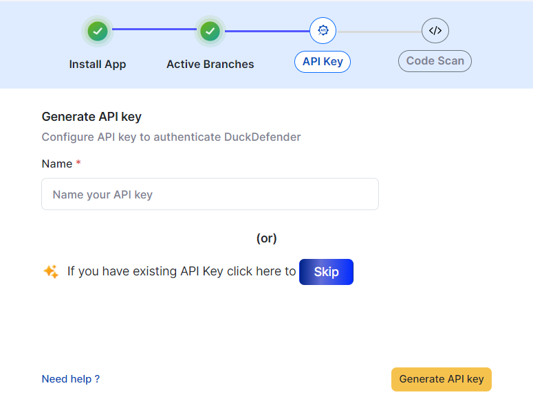

# BitBucket Integration

## Install App

On the Integrations page, click on **BitBucket** to start integration.


Before moving on to the next step in the FlyingDuck make sure to login to the bitbucket website so that it will navigate to the bitbucket website and shows the available workspaces of that specific user. And
need to have a work space in the bitbucket, move to **workspace settings** and make sure to enable the **enable development mode** in the **installed apps** section in the settings of bitbucket for all the required workspaces.


Under install app click on Go to **Proceed to install** button.


Click on **grant access** button on the bitbucket website to grant permission for FlyingDuck app in selected workspace.


After granting the acces to the respective workspace flying duck will intimate you that flying duck will have only read access. Then click on **Grant access** button.


when you click on **Grant access** button, App will get installed.


## Active Branches
Under active branches, specify the branch name as shown in the image.


By clicking on the **save** button, the branch name that u gave will be saved.


## API Key

If you've created API Key previously you can click on **Skip** or else you can create a new API Key.

Provide a name to your API Key that your about to create and click on **Generate API key**



A new API Key will be generated that will be shown once, so store it with you confidentially.


Clicking on **Next** will take you to code scan section.


<div id="bitbucketworkflow">
## Code Scan
The code scan can be done in two ways
- Workflows
- On-premise runner


### BitBucket workflow

Select BitBucket workflow to configure DuckDefender in BitBucket by adding the yml file, that you need to download from the flyingduck portal for Libraries and Secrets information.


#### Download DuckDefender

After selecting BitBucket workflow, then click the **Download**. This will download the bitbucket-pipelines.yml file which looks like this.

``` mdx filename="bitbucket-pipelines.yml" copy
# Version: '0.0.1'
pipelines:
  branches:
    main:
      - step: &DuckDefender
          name: DuckDefender scanner
          image: flyingduckio/duckdefender:latest
          caches:
            - docker
          script:
            # Define the DOCKER_TAG environment variable
            - export DOCKER_TAG="flyingduckio/duckdefender:latest"
            # Download image from docker hub
            - docker pull $DOCKER_TAG
            # Run the docker image
            - docker run  -e BITBUCKET_REPO_OWNER="$BITBUCKET_REPO_OWNER" -e BITBUCKET_REPO_SLUG="$BITBUCKET_REPO_SLUG"   -e BITBUCKET_BRANCH="$BITBUCKET_BRANCH"   -e BITBUCKET_COMMIT="$BITBUCKET_COMMIT"   -e FD_API_KEY="$FD_API_KEY"   -e PIPELINES_JWT_TOKEN="$PIPELINES_JWT_TOKEN" -e LOG_LEVEL="debug"  -e BITBUCKET_CLONE_DIR="$BITBUCKET_CLONE_DIR" -e ONLY_LATEST=True -v /opt/atlassian/pipelines/agent/build:/src  $DOCKER_TAG
          services:
            - docker

# Triggers the workflow on push events        
    master:
      - step: *DuckDefender
    develop:
      - step: *DuckDefender
    release:
      - step: *DuckDefender
      
```

After downloading the file go to **BitBucket website -> workspace -> Repository -> Repo settings**.
In the Repo settings:
- Go to **settings** and enable the pipelines.


- Go to **Repository variables** and enter the Api key name **FD_API_KEY** and Api Key value


After adding the file you should commit. Based on which branch you've commited, if the branch is included in the given file, the respective data like libraries, secrets will be sent to FlyingDuck portal.

#### Custom Branch
If you want to commit to the custom branch like `features/**********` and to check the findings of that branch then include that specific branch into the branches in bitbucket-pipelines.yml file.

```mdx filename="bitbucket-pipelines.yml" copy

# Triggers the workflow on push events        
    master:
      - step: *DuckDefender
    develop:
      - step: *DuckDefender
    release:
      - step: *DuckDefender
```


</div>


### On-premise Runner


<div style={{backgroundColor:'#ECFADF', borderLeft:"5px solid lightgreen", borderRadius:"7px",paddingLeft:"20px", paddingTop:"30px", paddingBottom:"30px"}}>

**Refer this for 
<a href="/DuckDefender/deploymentoptions/runners">`On-premise Runner`</a>**

</div>


