# GitHub Integration


## Install App


On the Integrations page, click on **GitHub** to start integration.


Under install app, provide the github organisation name and click on **Proceed to install** button.

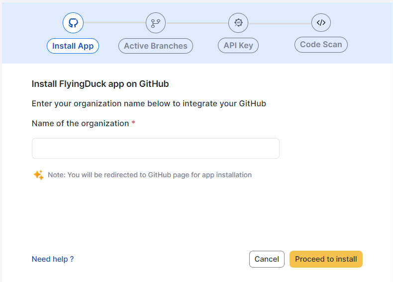

You will be redirected to app installation page on GitHub. Click on **Configure
button.**

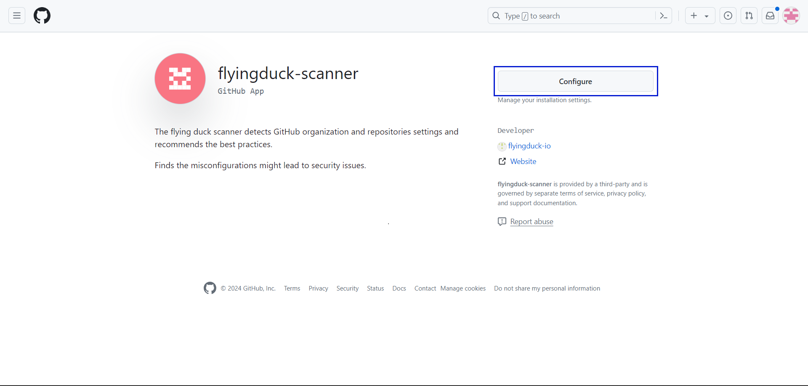

Choose the preferred **GitHub Organization.**

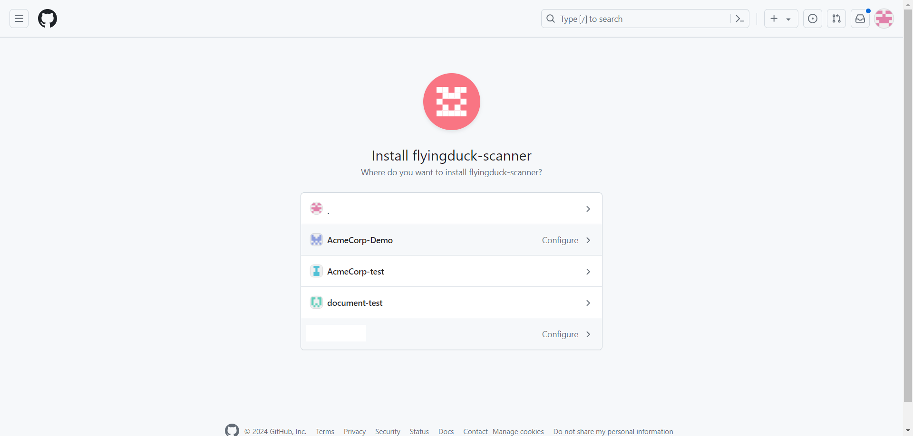

Select either All repositories or Only select repositories as per your choice and click
on **Install** to complete installation process.

<div style={{display:'flex', justifyContent:'center', alignItems:'center'}}>

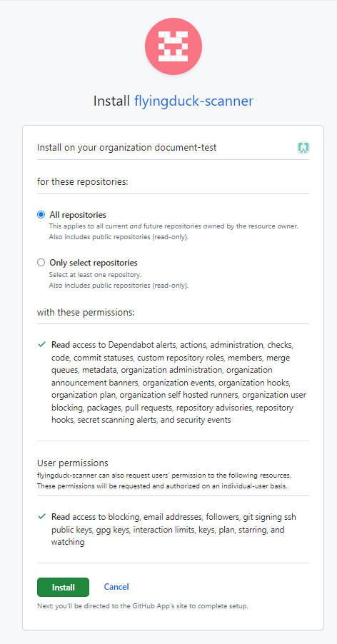
</div>

After installation, the user will be redirected to FlyingDuck portal.

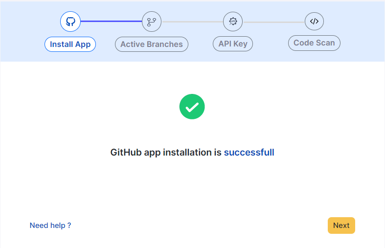

## Active Branches
Under active branches, specify the branch name as shown in the image.


By clicking on the **save** button, the branch name that u gave will be saved.


## Api key

If you've created API Key previously you can click on **Skip** or else you can create a new API Key.

Provide a name to your API Key that your about to create and click on **Generate API key**


A new API Key will be generated that will be shown once, so store it with you confidentially.


Clicking on **Next** will take you to code scan section. Before doing that there is an important step you need to complete.

Navigate to the GitHub repository (GitHub → GitHub Organization → GitHub
Repository) and click on **Settings** of the repository.

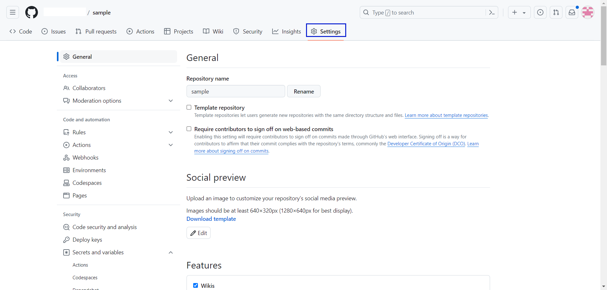

Under security tab click on **Secrets and variables** and then click on **Actions.**

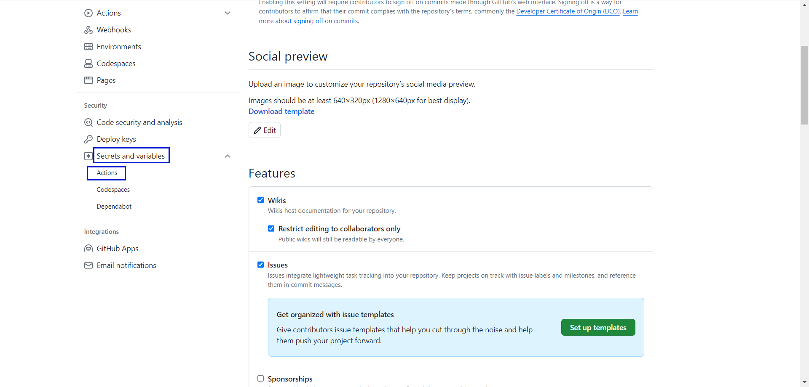

Click on **New repository secret.**

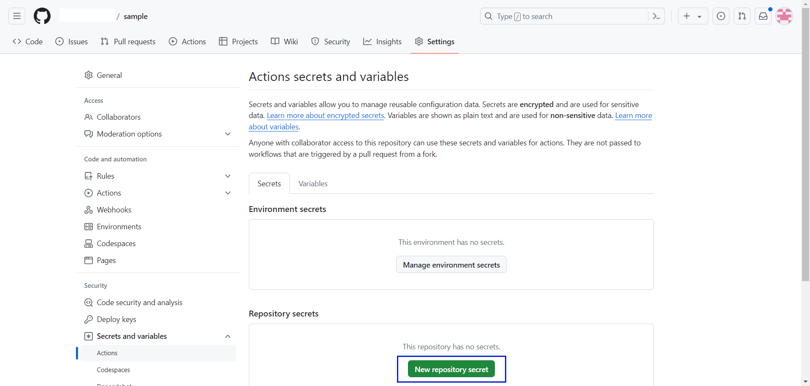

Enter the Name as “FD_API_KEY” and the API key that you have previously created in the Secret field. Click on **Add secret** to complete configuring the API key.

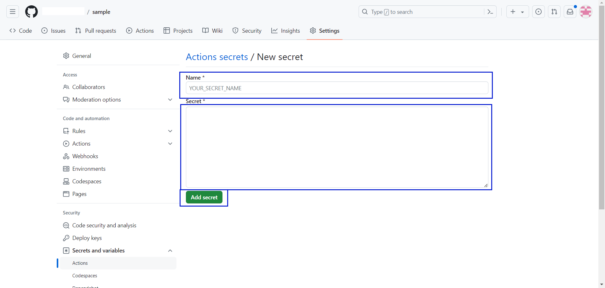
<br/>
<div style={{backgroundColor:'#EEEFFB', borderLeft:"5px solid #071dd1", borderRadius:"7px",paddingLeft:"20px", paddingTop:"30px", paddingBottom:"30px"}}>

**You can repeat the same procedure to the other repositories**

</div>


<div id="githubworkflow">

## Code Scan
The code scan can be done in two ways
- Workflows
- On-premise runner

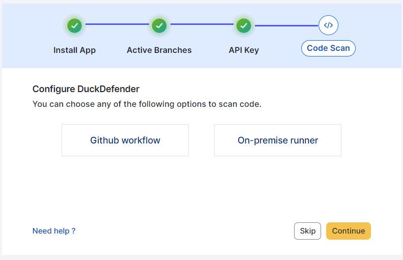

### GitHub workflow

Select GitHub workflow to configure DuckDefender in GitHub by adding the yml file, that you need to download from the flyingduck portal for Libraries and Secrets information.

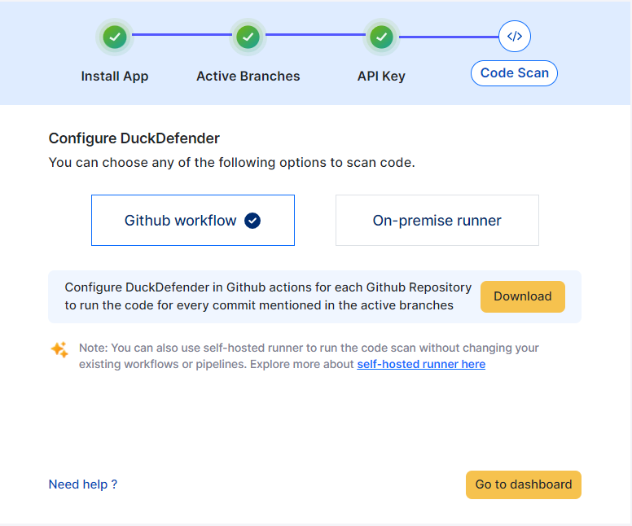

#### Download DuckDefender

After selecting GitHub workflow, then click the **Download**. This will download the duckdefender.yml file which looks like this.

```mdx filename="DuckDefender.yml" copy
env:
  docker_tag: flyingduckio/duckdefender:latest

# This is a basic workflow to help you get started with GitHub Actions 
name: DuckDefender

# Triggers the workflow on push events but only for the all the critical branches
on:
  push:
    branches: [ "master", "main", "release", "develop" ]
  
# A workflow run is made up of one or more jobs that can run sequentially or in parallel
jobs:
  build:
    runs-on: ubuntu-latest

# Steps represent a sequence of tasks that will be executed as part of the job
    steps:
    - uses: actions/checkout@v3

    # Download image from docker hub

    - name: Download latest DuckDefender
      run: docker pull "${{env.docker_tag}}"

    - name: Run DuckDefender
      run: |
        docker run -e GITHUB_REPOSITORY_OWNER="${{github.repository_owner}}" \
          -e GITHUB_REPOSITORY_OWNER_ID="${{github.repository_owner_id}}" \
          -e GITHUB_REPOSITORY="${{github.repository}}" \
          -e GITHUB_REPOSITORY_ID="${{github.repository_id}}" \
          -e GITHUB_EVENT_NAME="${{github.event_name}}" \
          -e GITHUB_ACTOR="${{github.actor}}" \
          -e GITHUB_ACTOR_ID="${{github.actor_id}}" \
          -e FD_API_KEY="${{secrets.FD_API_KEY}}" \
          -e GITHUB_TOKEN="${{github.token}}" \
          -e GITHUB_HEAD_REF="${{github.head_ref}}" \
          -e GITHUB_BASE_REF="${{github.base_ref}}" \
          -e GITHUB_REF="${{github.ref}}" \
          -e GITHUB_SHA="${{github.sha}}" \
          -e WORKSPACE_PATH="/src" \
          -e LOG_LEVEL="debug" \
          -v "${{ github.workspace }}":/src  "${{env.docker_tag}}"
```

Add this file in your local code by following the below steps:
- create `.github` folder
- create `workflows` folder
- `DuckDefender.yaml` file

After adding the file you should commit. Based on which branch you've commited, if the branch is included in the given file, the respective data like libraries, secrets will be sent to FlyingDuck portal.

#### Custom Branch
If you want to commit to the custom branch like `features/**********` and to check the findings of that branch then include that specific branch into the branches in duckdefender.yml file.

```mdx filename="DuckDefender.yml" copy

# Triggers the workflow on push events but only for the all the critical branches
on:
  push:
    branches: [ "master", "main", "release", "develop" ]
```

</div>

### On-premise Runner
<div style={{backgroundColor:'#ECFADF', borderLeft:"5px solid lightgreen", borderRadius:"7px",paddingLeft:"20px", paddingTop:"30px", paddingBottom:"30px"}}>

**Refer this for 
<a href="/DuckDefender/deploymentoptions/runners">`On-premise Runner`</a>**

</div>

