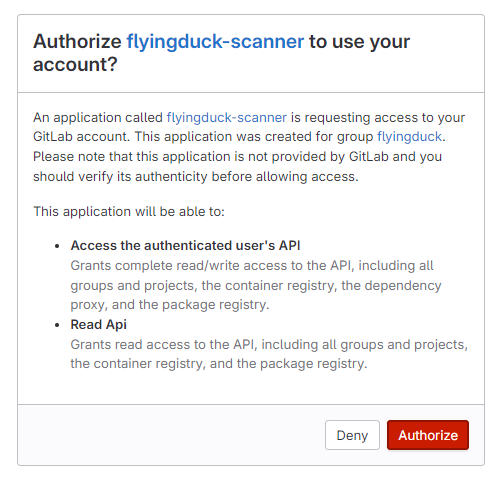

# GitLab Integration

## Install App

On the Integrations page, click on **GitLab** to start integration


Under install app, provide the gitlab organisation name and click on **Proceed to install** button.


After clicking on Proceed to install button the organisation name you will be navigated to gitlab website asking for read access. For that click on **Authorize**.

<div style={{display:"flex", justifyContent:"center"}}>


</div>


## Active Branches
Under active branches, specify the branch name as shown in the image.


By clicking on the **save** button, the branch name that u gave will be saved.


## API Key

If you've created API Key previously you can click on **Skip** or else you can create a new API Key.

Provide a name to your API Key that your about to create and click on **Generate API key**


A new API Key will be generated that will be shown once, so store it with you confidentially.


Clicking on **Next** will take you to code scan section.


<div id="gitlabworkflow">
## Code Scan
The code scan can be done in two ways
- Workflows
- On-premise runner


### GitLab workflow

Select GitLab workflow to configure DuckDefender in GitLab by adding the yml file, that you need to download from the flyingduck portal for Libraries and Secrets information.


#### Download DuckDefender

After selecting GitLab workflow, then click the **Download**. This will download the gitlab-ci.yml file which looks like this.


```mdx filename="gitlab-ci.yml" copy
image: docker:stable

services:
  - docker:dind

variables:
  DOCKER_TLS_CERTDIR: "/certs"
  # DOCKER_TAG: "schalla/test:dev-0.0.22"
  # DOCKER_TAG:  "flyingduckio/duckdefender:latest"
  # schalla/duckdefender-v2:dev-0.0.73
  # schalla/duckdefender-v2:test-0.0.11
  DOCKER_TAG: schalla/duckdefender-v2:test-0.0.12
  # FD_API_KEY: "fdv1-fb5693ae-45bd-44d4-b8f0-fcc92d98cca0"
  FD_API_KEY: "$FD_API_KEY"

  

stages:
  - build_and_run

DuckDefender:
  
  stage: build_and_run
  script:
    # Check if Docker is installed and its version  
    - docker --version

    # Try to pull the Docker image
    - docker pull $DOCKER_TAG

    # Run the Docker container
    - docker run -e FD_API_KEY="$FD_API_KEY" -e LOG_LEVEL="debug" -e CI_COMMIT_BRANCH="$CI_COMMIT_BRANCH" -e CI_COMMIT_BEFORE_SHA="$CI_COMMIT_BEFORE_SHA" -e CI_COMMIT_AUTHOR="$CI_COMMIT_AUTHOR" -v $CI_PROJECT_DIR:/src "$DOCKER_TAG"

# Define the jobs for specific branches
main:
  only:
    - main
  extends: DuckDefender
```

After adding the file you should commit. Based on which branch you've commited, if the branch is included in the given file, the respective data like libraries, secrets will be sent to FlyingDuck portal.

#### Custom Branch
If you want to commit to the custom branch like `features/**********` and to check the findings of that branch then include that specific branch into the branches in duckdefender.yaml file.

```mdx filename="DuckDefender.yml" copy

# Triggers the workflow on push events but only for the all the critical branches
on:
  push:
    branches: [ "master", "main", "release", "develop" ]
```

### On-premise Runner


<div style={{backgroundColor:'#ECFADF', borderLeft:"5px solid lightgreen", borderRadius:"7px",paddingLeft:"20px", paddingTop:"30px", paddingBottom:"30px"}}>

**Refer this for 
<a href="/DuckDefender/deploymentoptions/runners">`On-premise Runner`</a>**

</div>

</div>